# PortSwigger SQL Injection Labs - Comprehensive Notes

This document contains detailed notes, extracted workflows, and diagrams based on the PortSwigger SQL Injection lab diagrams.

---

## Lab 01: Product Category Filter

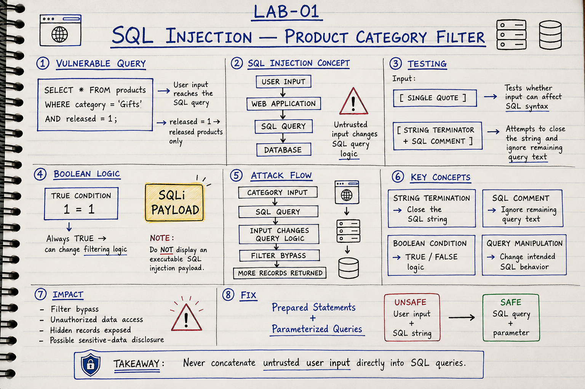

**Objective**: Display all products, including both released and unreleased products.
**Vulnerability**: SQL Injection (Boolean-based). The application uses a user-controlled `category` parameter directly inside an SQL query without properly sanitizing or parameterizing the input.

### Attack Flow

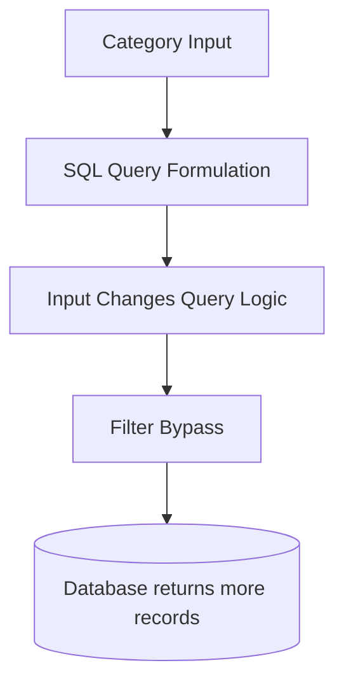

**Key Technique**: 
Use a string terminator and an SQL comment (e.g., `' OR 1=1--`) to manipulate the boolean condition to always evaluate to `TRUE`. This bypasses the original `released = 1` logic.

**Remediation**: Use Prepared Statements / Parameterized Queries. Never concatenate untrusted user input directly into SQL queries.

---

## Lab 02: Login Functionality

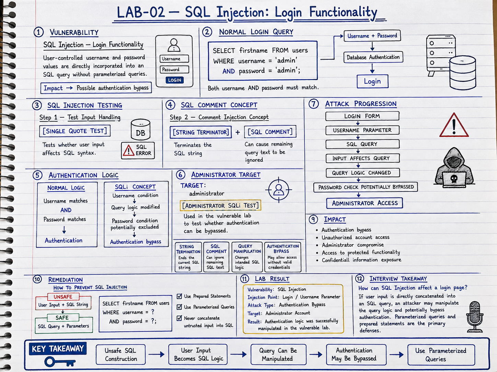

**Objective**: Bypass authentication to access the administrator account.
**Vulnerability**: Authentication Bypass via SQLi. Username and password fields are concatenated directly into the authentication query.

### Attack Flow

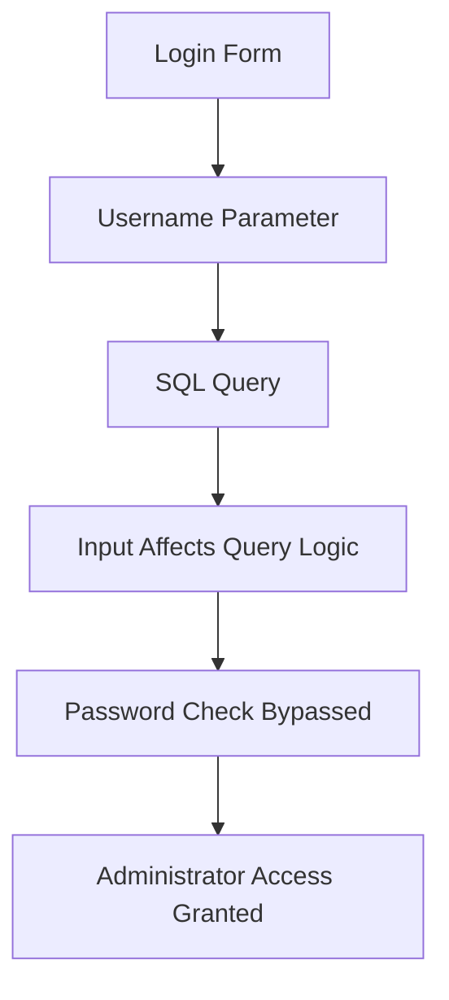

**Key Technique**:
Provide an input like `administrator'--`. The `'` terminates the username string, and `--` comments out the password validation check, allowing login without knowing the password.

---

## Lab 03 & 04: Determining Number of Columns & Data Types

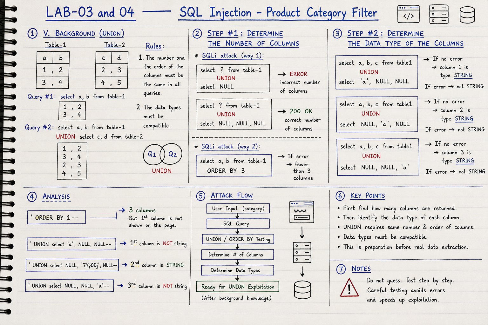

**Objective**: Determine the number of columns returned by the vulnerable query and find which columns are compatible with string data.
**Vulnerability**: UNION-based SQL Injection.

### Attack Methodology

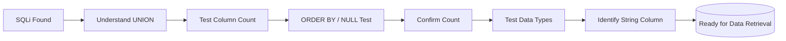

**Key Concepts**:
1. **UNION Rules**: The injected query must return the exact same number of columns as the original query.
2. **Column Counting**: Use `ORDER BY 1`, `ORDER BY 2`, etc., until an error occurs, or use `UNION SELECT NULL, NULL...` increasing the count until a `200 OK` is returned.
3. **Data Type Matching**: Replace `NULL` with a string value (e.g., `'a'`) one by one to find which columns accept string data.

---

## Lab 05: Retrieving Data from Other Tables

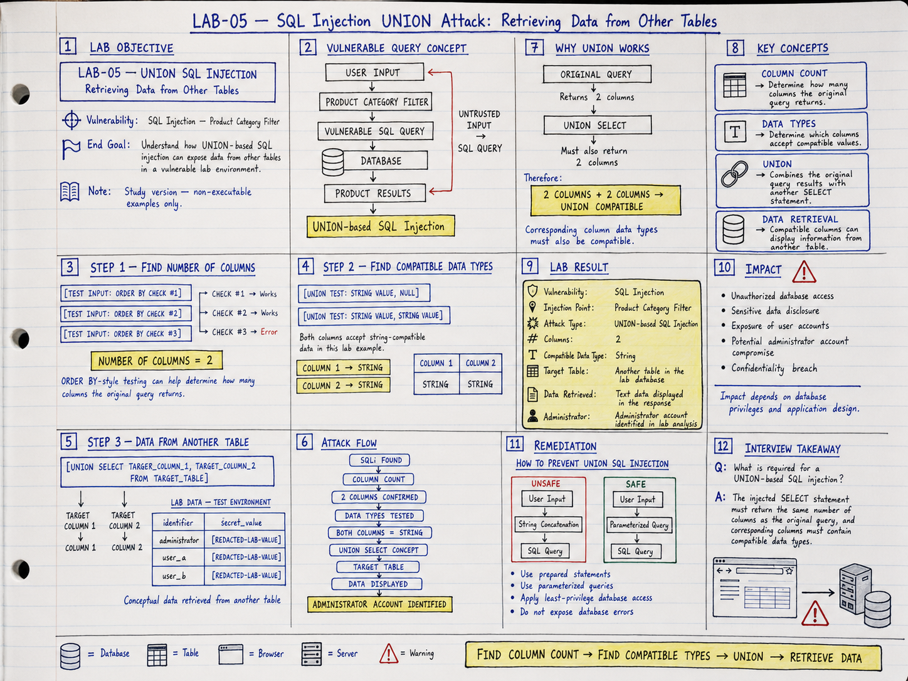

**Objective**: Understand how UNION-based SQL injection can expose data from other tables.
**Vulnerability**: UNION-based SQL Injection.

### Attack Flow

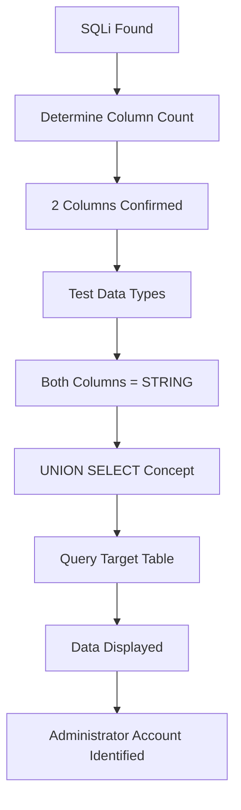

**Key Technique**:
Once column count and data types are determined, formulate a payload like:
`' UNION SELECT username, password FROM users--`

---

## Lab 06: Retrieving Multiple Values Within a Single Column

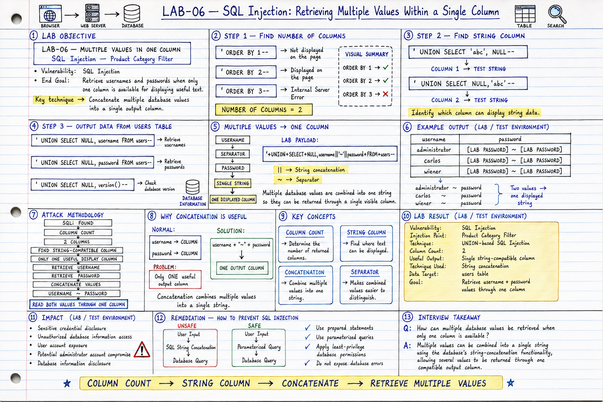

**Objective**: Retrieve usernames and passwords when only ONE column is available for displaying useful text.
**Key Technique**: String Concatenation.

### Attack Flow

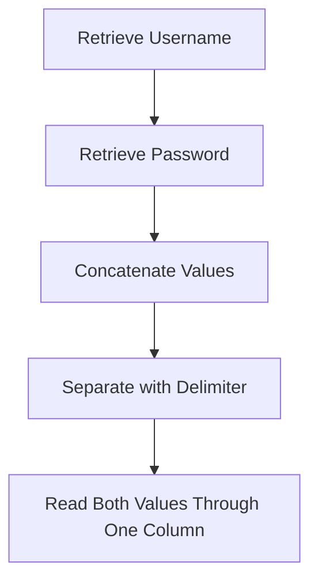

**Payload Example**:
`' UNION SELECT NULL, username || '~' || password FROM users--`
This joins the `username` and `password` with a `~` character, allowing both to be read from a single display column.

---

## Lab 07 & 08: Database Reconnaissance & Enumeration

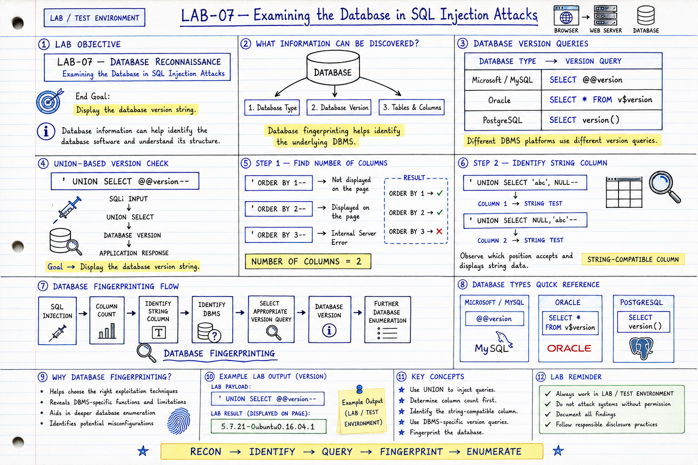
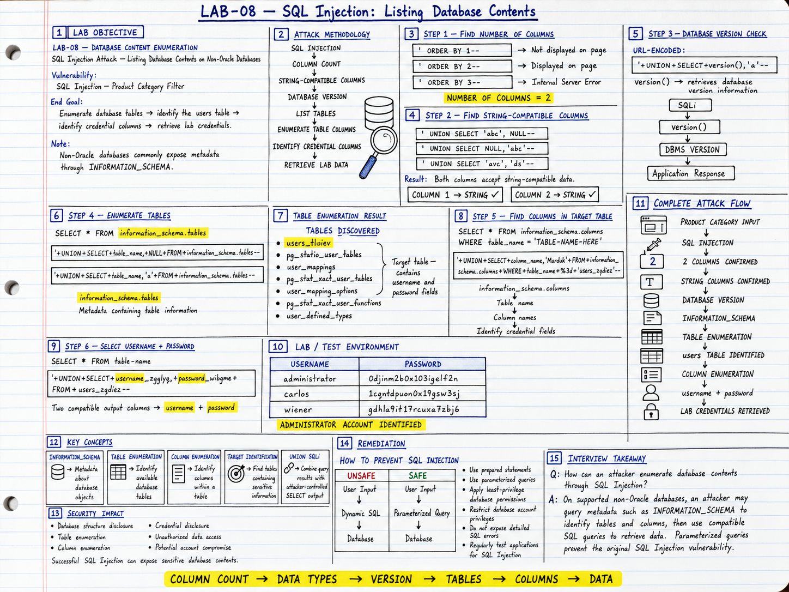

**Objective**: Examine the database version and enumerate database structure (Tables and Columns).
**Vulnerability**: SQL Injection (Information Schema).

### Database Fingerprinting Flow

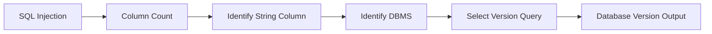

**Key Concepts**:
- **Information Schema**: Non-Oracle databases expose metadata through `information_schema.tables` and `information_schema.columns`.
- **Version Queries**: 
  - MySQL/Microsoft: `SELECT @@version`
  - PostgreSQL: `SELECT version()`
  - Oracle: `SELECT * FROM v$version`

---

## Lab 09: Blind SQL Injection (Conditional Responses)

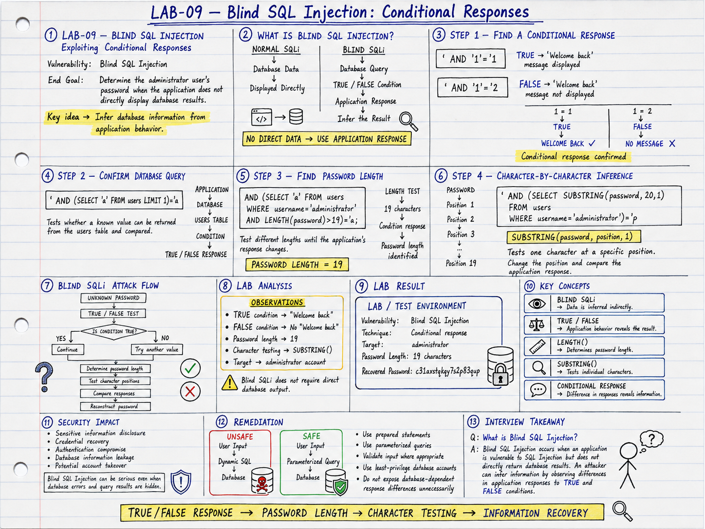

**Objective**: Determine the administrator's password when the application does not directly display database results.
**Vulnerability**: Blind SQL Injection.

### Attack Logic

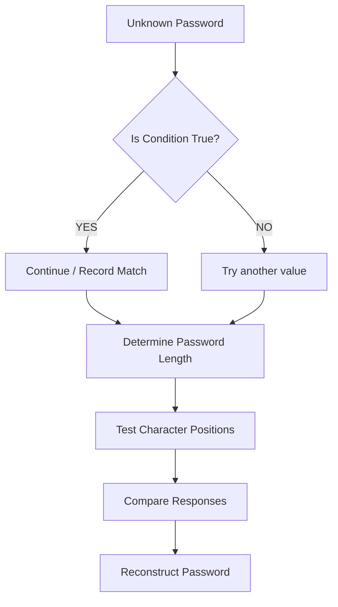

**Key Technique**:
Since data is not displayed, we rely on application behavior (e.g., whether a "Welcome back" message is shown) to answer TRUE/FALSE questions about the database. We first find the length, then iterate through characters using `SUBSTRING()`.

---

## Lab 10: Conditional Error-Based Blind SQLi

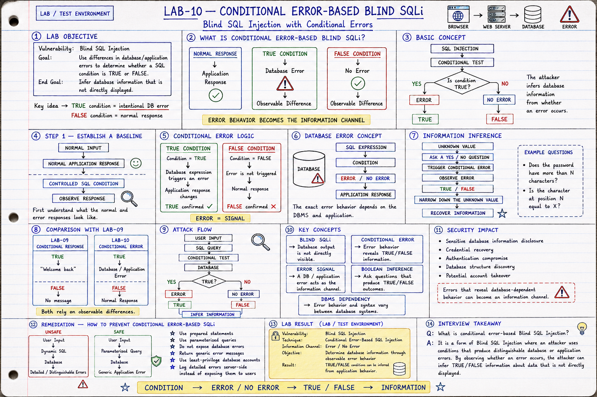

**Objective**: Infer database information through observable error behavior.
**Vulnerability**: Conditional Error-Based Blind SQLi.

### Error Inference Flow

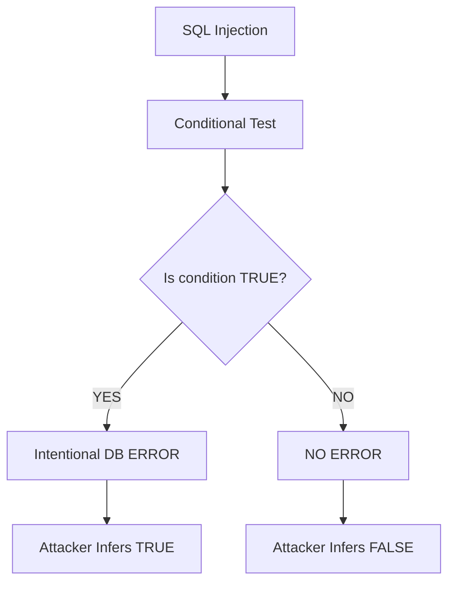

**Key Technique**:
Instead of relying on different text on the page, the attacker uses SQL syntax that triggers a database error (like division by zero) *only* if the condition evaluates to TRUE. The presence or absence of a Server Error becomes the information channel.

---

### Universal Remediation
* **Use Prepared Statements (Parameterized Queries)**
* **Validate input where appropriate**
* **Apply least-privilege database accounts**
* **Do not expose detailed database error messages to users**
